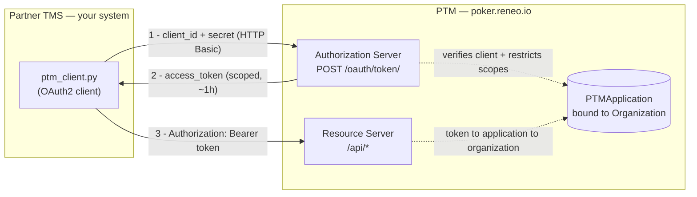
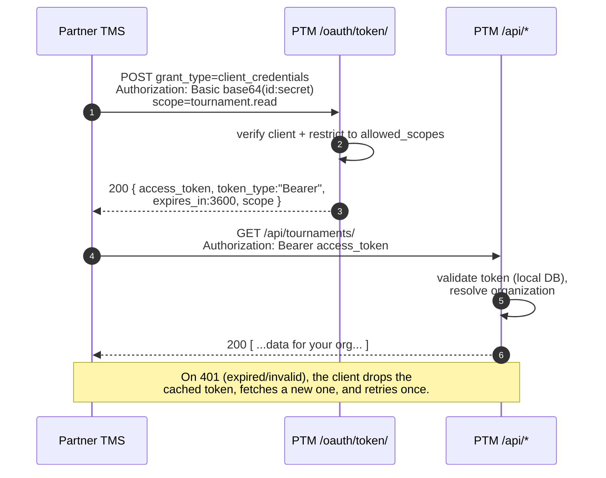
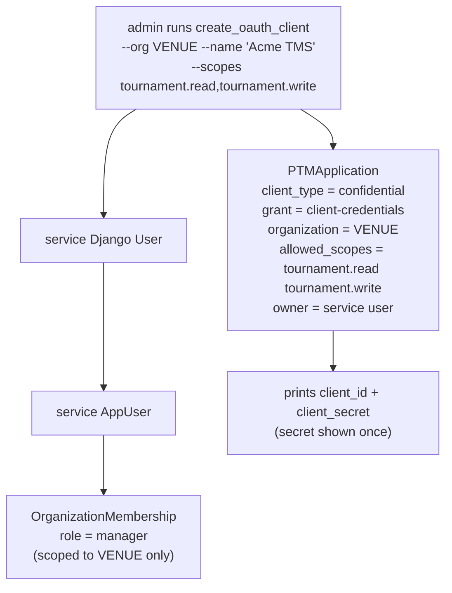
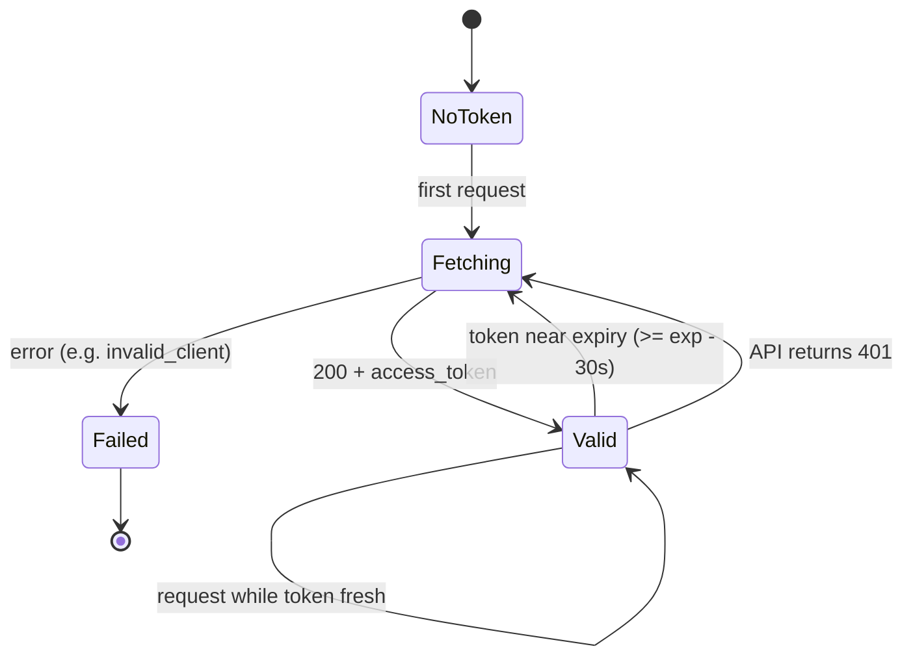
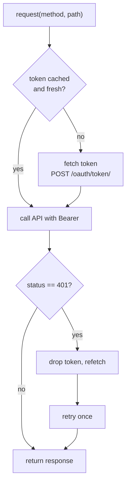

# PTM OAuth2 Integration Guide (for TMS integrators)

This guide shows how an external **Tournament Management System (TMS)** authenticates
to PTM and calls the PTM API using **OAuth2 Client Credentials** — a machine-to-machine
flow with **no user login and no Hanko**. Your system authenticates *as itself*, receives a
short-lived scoped token, and calls the API.

This repository **is** the complete, runnable reference client.
Copy [`ptm_client.py`](../ptm_client.py) as your starting point.

- **Base URL (prod):** `https://poker.reneo.io`
- **Token endpoint:** `POST /oauth/token/`
- **Discovery (RFC 8414):** `GET /.well-known/oauth-authorization-server`
- **Probe endpoint:** `GET /api/oauth/whoami/`

---

## 1. Concepts

| Term | Meaning |
|------|---------|
| **Client Credentials grant** | OAuth2 flow where the client authenticates with its own `client_id` + `client_secret`. No end user is involved. |
| **Access token** | An opaque bearer token, scoped, ~1 hour lifetime. Sent as `Authorization: Bearer <token>`. |
| **Scope** | A permission string (e.g. `tournament.read`). A client may only request scopes it was granted. |
| **Organization binding** | Every client is bound to exactly one PTM Organization (venue). Tokens act on behalf of that org. |
| **No refresh token** | Per the OAuth2 spec, client_credentials never issues refresh tokens. When a token expires, just request a new one. |

Hanko (PTM's passkey login) is **not** part of this flow — it only matters for the future
user-delegated (authorization-code) flow.

---

## 2. Architecture

PTM plays two OAuth2 roles: **Authorization Server** (issues tokens) and **Resource Server**
(its `/api/*` endpoints accept them). Token validation is a local database lookup — there is
no network introspection hop.



---

## 3. The end-to-end flow



---

## 4. Quick start

### Step 1 — Get credentials (PTM admin does this once)

A PTM administrator provisions a client for your organization:

```bash
python manage.py create_oauth_client \
  --org <VENUE_CODE> \
  --name "Acme TMS" \
  --scopes tournament.read,tournament.write
```

This prints your `client_id` and `client_secret`. **The secret is shown once** — store it
securely. To rotate it, the admin deletes and recreates the client.

### Step 2 — Fetch a token

```bash
curl -u "$CLIENT_ID:$CLIENT_SECRET" \
  -d grant_type=client_credentials \
  -d scope="tournament.read" \
  https://poker.reneo.io/oauth/token/
```

```json
{
  "access_token": "8xLOxBtZp8...",
  "expires_in": 3600,
  "token_type": "Bearer",
  "scope": "tournament.read"
}
```

### Step 3 — Call the API

```bash
curl -H "Authorization: Bearer $ACCESS_TOKEN" \
  https://poker.reneo.io/api/tournaments/
```

### Step 4 — Verify who you are (handy for debugging)

```bash
curl -H "Authorization: Bearer $ACCESS_TOKEN" \
  https://poker.reneo.io/api/oauth/whoami/
```

```json
{
  "organization": "Acme Poker Club",
  "organization_id": "0e8c...",
  "auth_method": "oauth2",
  "scopes": ["tournament.read"]
}
```

### Step 5 — Refresh when expired

There is no refresh token. When a call returns `401`, request a new token (Step 2) and retry.
The reference client does this automatically.

---

## 5. How provisioning works

`create_oauth_client` does more than mint a client — it wires the client to a per-org
**service identity** so issued tokens flow through PTM's existing permission system.



Every token issued to this client carries that service identity and is bound to `VENUE`.
The binding is what keeps your access scoped to your own organization.

---

## 6. Scopes

| Scope | Grants |
|-------|--------|
| `tournament.read` | Read tournaments, levels, registrations |
| `tournament.write` | Create / update tournaments |
| `player.read` | Read player / registration data |
| `player.write` | Create / update registrations |
| `organization.read` | Read organization (venue) data |
| `reporting.read` | Read reporting / analytics data |

**Scope enforcement today (read this carefully):**

- ✅ **Token issuance is scope-restricted.** A client may only obtain tokens for the scopes it
  was granted. Requesting an ungranted scope returns `400 invalid_scope`:

  ```bash
  # client granted only tournament.read
  curl -u "$ID:$SECRET" -d grant_type=client_credentials \
    -d scope="tournament.write" https://poker.reneo.io/oauth/token/
  # -> {"error":"invalid_scope"}
  ```

- ⚠️ **Per-endpoint API scope checks are a planned enhancement.** In this POC, once a token is
  issued, the data API authorizes by the client's organization membership, not by the token's
  scope. Practically: request only the scopes you need, and treat your `allowed_scopes` as the
  real boundary. Fine-grained `required_scopes` enforcement on each `/api/*` endpoint (so a
  `tournament.read`-only token is refused a write with `403`) is on the roadmap — see
  [Known limitations](#9-known-limitations--roadmap).

---

## 7. Reference client walkthrough

The reference client is intentionally small and dependency-light. The reusable core is
`PTMClient` in [`ptm_client.py`](../ptm_client.py):

```python
client = PTMClient(
    base_url="https://poker.reneo.io",
    client_id="...",
    client_secret="...",
    scope="tournament.read tournament.write",
)

resp = client.request("GET", "/api/tournaments/")   # token fetched + cached automatically
tournaments = resp.json()
```

It handles three things for you:

1. **Token fetch** via HTTP Basic auth to `/oauth/token/`.
2. **Caching** until ~30s before expiry (no token request per call).
3. **Transparent re-auth** — on a `401`, it drops the token, refetches, and retries once.

### Token lifecycle (inside the client)



### Request flow with one-shot re-auth



### Running the sample app

```bash
git clone https://github.com/reneodlt/nuts-sample-tms.git
cd nuts-sample-tms
cp .env.example .env          # paste client_id / client_secret
pip install -r requirements.txt
./run.sh                      # then open http://localhost:8095
```

| File | Role |
|------|------|
| `ptm_client.py` | The reusable OAuth2 client (token fetch / cache / re-auth). **Copy this.** |
| `app.py` | A small FastAPI UI: status + whoami, list tournaments, create tournament. |
| `config.py` | Reads `PTM_BASE_URL`, `PTM_CLIENT_ID`, `PTM_CLIENT_SECRET`, `PTM_SCOPE` from env. |
| `templates/` | Minimal HTML pages. |

The **Status** page calls `/api/oauth/whoami/` and shows your resolved organization, auth
method, granted scopes, and the cached token's remaining lifetime.

---

## 8. Endpoint reference

| Endpoint | Method | Auth | Purpose |
|----------|--------|------|---------|
| `/oauth/token/` | POST | Basic (client_id:secret) | Obtain an access token |
| `/oauth/introspect/` | POST | Bearer | Inspect a token |
| `/oauth/revoke_token/` | POST | Basic | Revoke a token |
| `/.well-known/oauth-authorization-server` | GET | none | RFC 8414 discovery metadata |
| `/api/oauth/whoami/` | GET | Bearer (`tournament.read`) | Resolved org + scopes (debug probe) |
| `/api/tournaments/` | GET / POST | Bearer | List / create tournaments |
| `/api/players/registrations/` | GET / POST | Bearer | Read / create registrations |
| `/api/docs/` | GET | — | Full OpenAPI / Swagger reference |

Discovery example:

```bash
curl https://poker.reneo.io/.well-known/oauth-authorization-server
```
```json
{
  "issuer": "https://poker.reneo.io",
  "token_endpoint": "https://poker.reneo.io/oauth/token/",
  "introspection_endpoint": "https://poker.reneo.io/oauth/introspect/",
  "revocation_endpoint": "https://poker.reneo.io/oauth/revoke_token/",
  "grant_types_supported": ["client_credentials"],
  "token_endpoint_auth_methods_supported": ["client_secret_basic", "client_secret_post"],
  "scopes_supported": ["tournament.read", "tournament.write", "player.read",
                       "player.write", "organization.read", "reporting.read"]
}
```

---

## 9. Error handling

| HTTP | `error` | Meaning / fix |
|------|---------|---------------|
| 400 | `invalid_scope` | You requested a scope outside your `allowed_scopes`. Request only granted scopes. |
| 400 | `unsupported_grant_type` | Use `grant_type=client_credentials`. |
| 401 | `invalid_client` | Wrong `client_id`/`client_secret`, or wrong auth method. Use HTTP Basic. |
| 401 | (on `/api/*`) | Token expired or invalid. Fetch a new token and retry. |
| 403 | — | Authenticated but not permitted for that resource. |

---

## 10. Security notes

- **Secrets are hashed at rest** in PTM; the plaintext secret is shown only once at creation.
  Store it in your secrets manager — never in source control.
- **Always use HTTPS** in production. Tokens and the Basic-auth header are bearer credentials.
- **Tokens are short-lived (~1h)** and cannot be refreshed — request a new one when needed.
- **Request least privilege** — ask only for the scopes you actually use.

---

## 11. Known limitations & roadmap

This is a proof-of-concept. Current limitations, in priority order:

1. **Per-endpoint API scope enforcement** — token *issuance* is scope-restricted, but the data
   API does not yet refuse a call whose token lacks the matching scope (authorization is by org
   membership). Planned: add `required_scopes` + scope permissions to the Tournament /
   Registration endpoints so a read-only token gets a clean `403` on writes.
2. **Least-privilege service identity** — a provisioned client is currently granted a `manager`
   role at its org regardless of scopes. Planned: align the service role with the granted scopes.
3. **List-endpoint org scoping** — some read/list endpoints are not yet filtered to the token's
   organization unless an explicit `organization_id` filter is passed.
4. **User-delegated flow** (authorization-code + Hanko consent), external player-identity
   mapping, and outbound webhooks (PTM → TMS) are future phases.

The full design and phasing document lives in the (private) PTM repository
(`docs/superpowers/specs/2026-06-08-oauth2-tms-integration-design.md`).

---

## 12. Troubleshooting

- **`invalid_client` even with the right secret** — ensure you're using HTTP Basic
  (`curl -u id:secret`), not posting the secret in the body, and that the client wasn't revoked.
- **`whoami` shows `organization: null`** — the client isn't bound to an org; re-provision it.
- **Token works then suddenly 401s** — it expired (~1h). Fetch a new token. The reference
  client handles this automatically.
- **Need the full data model?** — browse the live OpenAPI docs at `/api/docs/`.
